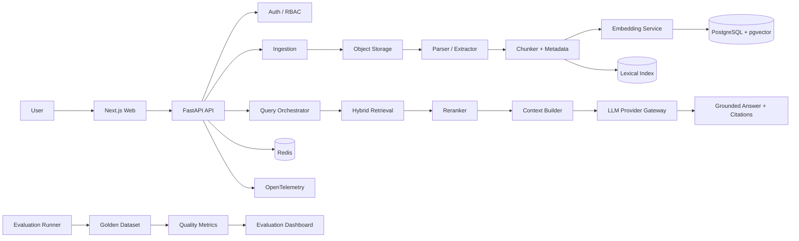

# AtlasAI Architecture

Source: [Notion Architecture & Build Plan](https://app.notion.com/p/3e3bbfeb609681d19663dfabb62a101b?pvs=204).

```mermaid
flowchart LR
 U[User] --> W[Next.js Web]
 W --> A[FastAPI API]
 A --> AUTH[Auth / RBAC]
 A --> ING[Ingestion]
 A --> Q[Query Orchestrator]
 ING --> OBJ[Object Storage]
 OBJ --> P[Parser / Extractor]
 P --> C[Chunker + Metadata]
 C --> E[Embedding Service]
 E --> V[(PostgreSQL + pgvector)]
 C --> L[(Lexical Index)]
 Q --> H[Hybrid Retrieval]
 H --> R[Reranker]
 R --> CB[Context Builder]
 CB --> G[LLM Provider Gateway]
 G --> ANS[Grounded Answer + Citations]
 A --> CACHE[(Redis)]
 A --> OT[OpenTelemetry]
 EV[Evaluation Runner] --> GD[Golden Dataset]
 GD --> MET[Quality Metrics]
 MET --> DASH[Evaluation Dashboard]
```
